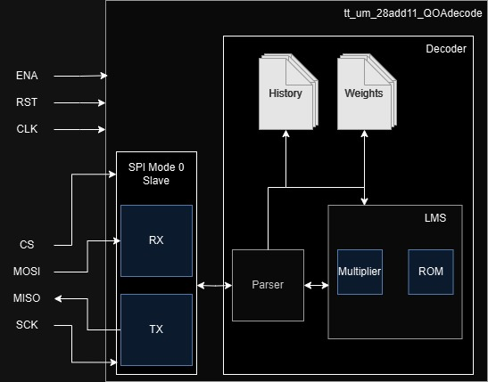
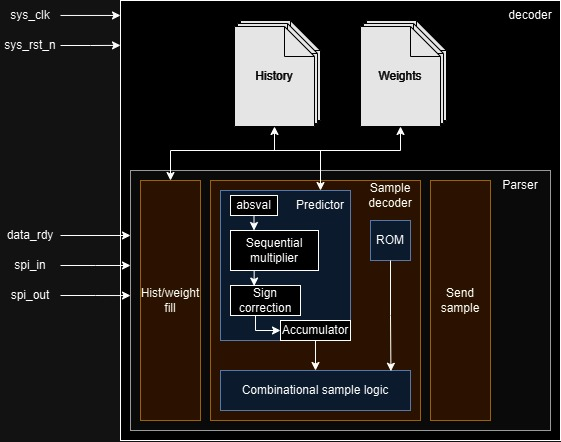

<!---

This file is used to generate your project datasheet. Please fill in the information below and delete any unused
sections.

You can also include images in this folder and reference them in the markdown. Each image must be less than
512 kb in size, and the combined size of all images must be less than 1 MB.
-->

## How it works

This chip is for decoding the QOA audio format, which is designed to be a simple, fast format for 16 bit PCM audio data. The specification is one page, and is availible at [qoaformat.org](https://qoaformat.org/). The chip communicates through an SPI slave mode 0 interface to a controller chip, which handles the file interface and all adjecent functions. The chip only handles decoding samples into their 16 bit uncompressed versions. 

### Block diagram

The chip itself consists of two main parts, an SPI interface for communication, and the decoder itself. The decoder contains a parser for the SPI data, the LMS predictor/updater at the heart of the QOA format, and the history/weights for the LMS predictor. 
For die area savings, we use a sequential multiplier in the LMS predictor, and save on the expensive dequantizing computations by using a precalculated table from the [reference code on Github](https://github.com/phoboslab/qoa). We save space further by only saving half the values, since every odd index is just the negative counterpart of the previous value, and we can just flip the sign.

### The decoder itself

The decoder has three main parts, registers for the LMS history and weights, a parser for handling SPI data, and the QOA decoder in the parser.

First off, whenever `data_rdy` is pulsed, the main state machine in the parser decodes `spi_in` into either a hist/weights fill instruction, a sample decode instruction, or a sample send instruction.
- If the instruction is a hist/weights fill, it takes the next 2 bytes (i.e. 2 `data_rdy` pulses) and puts them into the history or weights registers specified by the index in the instruction.
- If the instruction is a sample send request, the parser will set the `spi_out` register to the upper bit of sample, wait for it to transmit (8 SPI clock cycles, so a `data_rdy` pulse), then set it to the low byte and finish the transmission.
- Finally, if it is a sample decode instruction, it will iteratively multiply the history and weights values using a sequential multiplier, adding them to an accumulator. It then uses combinational logic and the ROM to calculate the final sample. This is then used to update history, weights, and is sent if a sample send request is recived.

## How to test

Connect the chip to a mode 0 SPI master, with a clock rate at least 6x slower than the chip clock. Then, fill the LMS history and weights, by using the following instruction:
| bit[7] | bit[6] | bit[5] | bit[4] | bit[3] | bit[2] | bit[1] | bit[0] |
| ------ | ------ | ------ | ------ | ------ | ------ | ------ | ------ |
|   0   |      |      |      | Adress[1] | Adress[0] | BankSel |   0    |

BankSel chooses between history and weights, 1 for weights and 0 for history. Adress is just which of the 4 values to fill, as specified by QOA. The next two bytes are the data to fill the history or weights with, MSB first.
If you want to then send a sample, the following instruction is used:
| bit[7] | bit[6] | bit[5] | bit[4] | bit[3] | bit[2] | bit[1] | bit[0] |
| ------ | ------ | ------ | ------ | ------ | ------ | ------ | ------ |
| sf_quant[3] | sf_quant[2] | sf_quant[1] | sf_quant[0] | qr[2] | qr[1] | qr[0] |   1    |

qr and sf_quant are exactly as they are in the QOA specification, with this chip decoding sample by sample.

After sending the sample, wait 40 chip clock cycles, then request the sample with the following instruction:
| bit[7] | bit[6] | bit[5] | bit[4] | bit[3] | bit[2] | bit[1] | bit[0] |
| ------ | ------ | ------ | ------ | ------ | ------ | ------ | ------ |
|   1    |        |        |        |        |        |        |   0    |

Once you send that instruction, the next two bytes sent by the chip will be the decoded sample, MSB first.
While you are reciving the sample, you can send any data, but it will be ignored. The chip will send unknown data when the instruction is not used.

On the testbench, it can calculate one sample every 5680ns, SPI transfer included, at a clock speed of 50MHz and an SPI frequency of 8MHz, which should be achivable on hardware. This can likely be improved by using a custom/different approach to SPI, since my test bench leaves relatively long periods of inactivity. The current speed results in a max of 176,056 samples per second, more than enough for real time audio streaming. 

Eventually I will get arould to writing code for the interface on [my Github](https://github.com/28add11), please look back there for updates.

## External hardware

Since this is a co-processor for the QOA format, a seperate microcontroller is required to interface with it. Since I am used to the RP2040 and it is included on the Tiny Tapeout PCB, I will likely provide software for it on my Github in the future. I plan to take a streaming approach with this software, so a PC supporting USB will also be needed to send, store, and convert the files. 