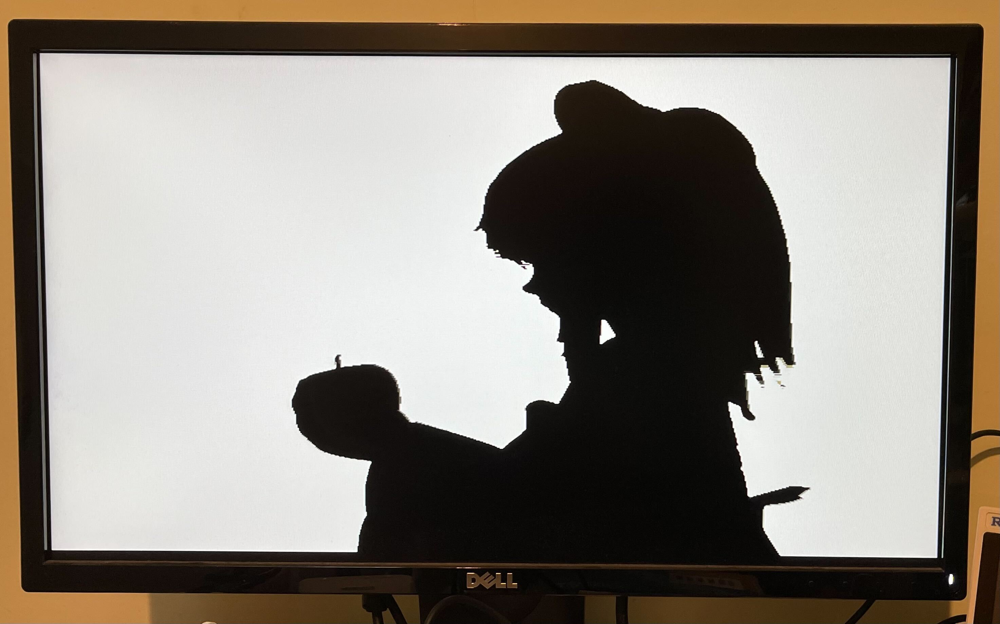

<!---

This file is used to generate your project datasheet. Please fill in the information below and delete any unused
sections.

You can also include images in this folder and reference them in the markdown. Each image must be less than
512 kb in size, and the combined size of all images must be less than 1 MB.
-->

## How it works

A 6bpp run length encoded image or video is read from a W25Q128JV or similar QSPI flash, and output to 640x480 VGA.

This is perfect for displaying the Bad Apple music video.

### Run Length Encoding

The encoding uses 16-bit words. Most words are a run length in the top 10 bits, and a colour in the bottom 6 bits.  A run must come to the end at the end of each row.

A row can be repeated by encoding a word `0xF800` + number of repeats at the end of a row.

A run must be at least 2 pixels, and any group of 3 consecutive runs within a row must be at least 24 pixels, otherwise the data buffer will empty.  This could definitely be improved!

If input 3 is high, each frame is repeated once, so playback is 30Hz instead of 60Hz.

The data is read starting at address 0.  The special word `0xFFC0` causes the player to stop and restart from address 0 at the beginning of the next frame, restarting the video.  This could also be used to display a still image.

## How to test

Create a RLE binary file (docs/scripts to do this TBD) and load onto the flash.  The pinout matches the [QSPI PMOD](https://github.com/mole99/qspi-pmod).  Connect that to the bidi pins.  Note the flash must support the h6B Fast Read Quad Output command, with 8 dummy cycles between address and data.

Connect the [Tiny VGA PMOD](https://github.com/mole99/tiny-vga) to the output pins.

Inputs 2-0 set the read latency for the SPI in half clock cycles, it's likely that will need to be set to 2 (set input 1 high and inputs 0 and 2 low).  This latency depends on the total round trip time through the mux and out to the flash and back.  Valid values are 1 to 4.

Run with a 25MHz clock (or ideally 25.175MHz).

## External hardware

* [QSPI PMOD](https://github.com/mole99/qspi-pmod)
* [Tiny VGA PMOD](https://github.com/mole99/tiny-vga)
