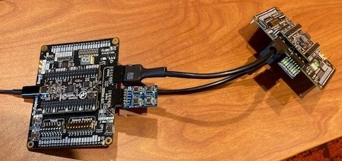

<!---

This file is used to generate your project datasheet. Please fill in the information below and delete any unused
sections.

You can also include images in this folder and reference them in the markdown. Each image must be less than
512 kb in size, and the combined size of all images must be less than 1 MB.
-->

## How it works

# Send Recieve Project Description
*A simple 4-value send/receive chip*

This project realizes a very simple 4-value sender and receiver chip. The mode 
of the chip is determined by input 7: **sender low, receiver high**. Currently,
the protocol only supports 1 sender and 1 receiver.

### Sender Mode
Sender mode is enabled when **Input\[7\]** is set low. In sender mode, the chip 
looks for a rising value on bits 0:4 of the input bus. This can be achieved 
through the use of a 4-button PMOD module, or by toggling the corresponding DIP 
switch on the carrier board.

***Sender Mode Input:***

| \# | Input      | Description               |
| -- | ---------- | ------------------------- |
| 0  | input\[0\] | bit\[0\] to send          |
| 1  | input\[1\] | bit\[1\] to send          |
| 2  | input\[2\] | bit\[2\] to send          |
| 3  | input\[3\] | bit\[3\] to send          |
| 4  | unused     | N/A                       |
| 5  | unused     | N/A                       |
| 6  | unused     | N/A                       |
| 7  | input\[7\] | Sender/Receiver indicator |

To send data, the sender pulls **Output\[0\]** high and relays the corresponding 
input bit (i) on **Output\[i+1\]** (Note: currently only one bit can be sent at 
a time). The Sender also sets **Output\[7\]** to indicate to the connected chip
that it should operate in receiver mode. 

Finally, The sender keeps **Output\[0\]** high long enough to prevent the 
receiver's debounce filtering from masking the signal before setting it low 
again.

***Sender Mode Output:***

| \# | Output                    | Description                  |
| -- | ------------------------- | ---------------------------- |
| 0  | Transmit                  | Signal receiver to read data |
| 1  | x\_bit\[0\]               | Transmit bit\[0\]            |
| 2  | x\_bit\[1\]               | Transmit bit\[1\]            |
| 3  | x\_bit\[2\]               | Transmit bit\[2\]            |
| 4  | x\_bit\[3\]               | Transmit bit\[3\]            |
| 5  | unused                    | N/A                          |
| 6  | unused                    | N/A                          |
| 7  | Mode\_of\_connected\_chip | Sender/Receiver indicator    |

### Receiver Mode
Receiver mode is enabled when **Input\[7\]** is set high. In receiver mode, the 
chip listens on **Input\[0:5\]**. It waits until the positive edge of
**Input\[0\]** before registering an input. 

***Receiver Mode Input***:

| \# | Input      | Description               |
| -- | ---------- | ------------------------- |
| 0  | Read       | Read input bits           |
| 1  | input\[0\] | recv\_ bit\[0\]           |
| 2  | input\[1\] | recv\_ bit\[1\]           |
| 3  | input\[2\] | recv\_ bit\[2\]           |
| 4  | input\[3\] | recv\_ bit\[3\]           |
| 5  | unused     | N/A                       |
| 6  | unused     | N/A                       |
| 7  | input\[7\] | Sender/Receiver indicator |

The chip utilizes the carrier chip's 7 segment display to echo a value 
corresponding to the input data:

| Input\[1:4\] | Output Value | Display Value |
| :----------: | :-----------: | :-----------: |
| 1000 | 0000_0110 | 1 |
| 0100 | 0101_1011 | 2 |
| 0010 | 0110_0110 | 4 |
| 0001 | 0111_1111 | 8 |

The receiver initially displays zero (on the 7-segment display) until it
receives the read signal from the sender. The receiver then displays the
value received or an E when the value is not 1, 2, 4, and 8. The last
value received, or E is displayed until the receives gets the signal to
read the next value.

## How to test

To connect two chips, configure them as follows:

- Sender
  - Inputs: (Choose One)
    - None (i.e. the chip will read data from the carrier chip's DIP switches)
    - 6-pin, 4-button PMOD keypad plugged into **Input\[0-5\]** (top row)
  - Outputs:
    - Connect all 12 output pins to the inputs on the receiver
- Receiver
  - Inputs
    - Power, ground, and all 8 data pins from the sender must be connected to the receiver's **corresponding** inputs. This requires the use of a specially crafted cross-over cable to ensure the correct connections.

## External hardware

- PMOD 4 button keypad
