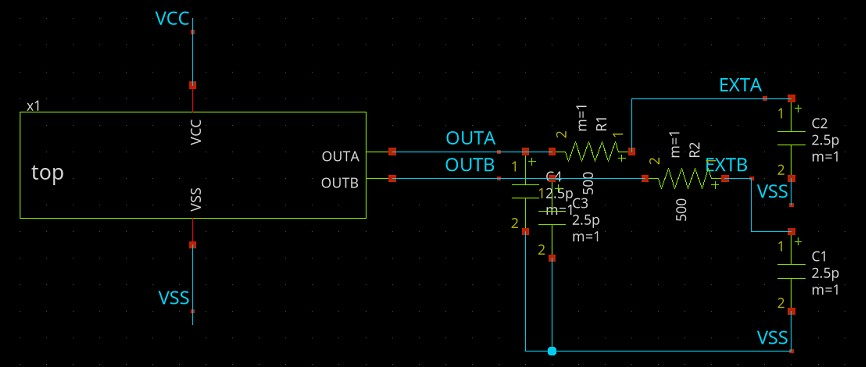
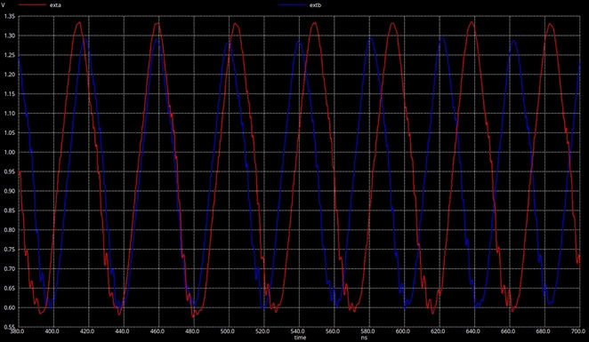
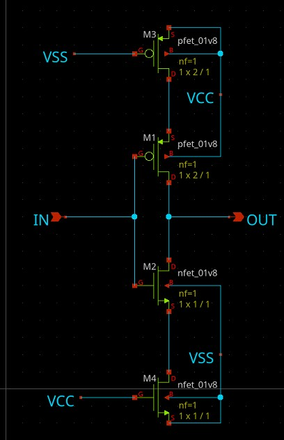
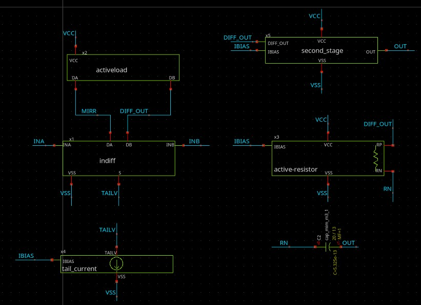
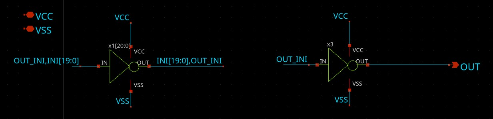
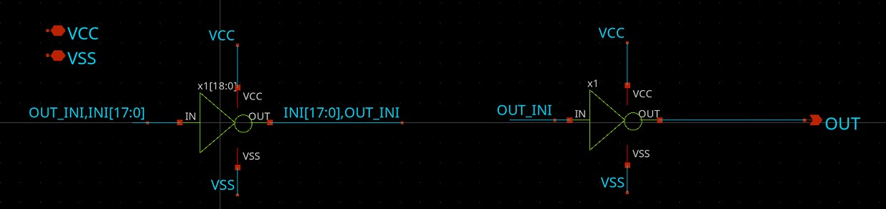
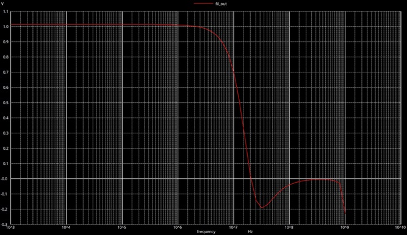

<!---

This file is used to generate your project datasheet. Please fill in the information below and delete any unused
sections.

You can also include images in this folder and reference them in the markdown. Each image must be less than
512 kb in size, and the combined size of all images must be less than 1 MB.
-->

## How it works

This project should generate 2 sinusoidal oscillators centered around ~0.9V relative to the chips ground. The oscillators are based on a pair of ring oscillators so they should oscillate regardless of the chips corner; however, their frequency will vary together dramatically. Their final simulated output frequencies are slightly above their respective targets of 20MHz and 21Mhz with a slightly greater seperatation between them.

### Inverter

The inverter has dummy transistors added on both sides of it. This is less for some practical matching purpose and more as a way to deliberately add some additional capacitance into the circuit to slow the inverters down. A good potential improvement would be to add switches to the dummy transistors here to enable and disable the oscillators on command. 

### Op Amp

The Op Amp is designed based on the work in [opamp_1_design.md](link-to-opamp_1_design.md). It is a basic 2 stage voltage feedback op-amp. The final transistor sizings have been adjusted post design to help with simplifying layout. The designed frequency for the Op Amp is a unity gain frequency of ~50Mhz, with a load capacitance of 5pF to allow it to effectively drive the chip outputs. 

#### Analog Buffer
The analog buffer component is simply an op-amp configured as a voltage follower. This is mostly made into a seperate module to maintain consistency across followers as well as to minimize the amount of layout work required as the component gets reused multiple times.

### Oscillator 20Mhz - 21Mhz

The oscillators are basic ring oscillators with a single op-amp on the output. They are 21 and 19 inverters long respectively. These produce close to the desired output frequencies. 

### filter 22Mhz

This is a second order butterworth filter intended to cut-off higher order components of the oscillators square wave output and provide a sinewave output. It keeps the DC component so as not to hit either of the chips rails. 

#### Capacitor Array
The Filter response relies on the capacitors matching relatively closely. Therefore they have been split into even sized segments and laid out according to centroid matching techniques so that on each filter they maintain relatively even responses. 

## How to test

Hook the outputs up to an oscilloscope or other device to measure the frequency generated. 

## External hardware

No external hardware is required for this module to function. The internal driving circuitry is designed around driving ~5pF, so it should be able to properly drive most high-impedance inputs to be used elsewhere in the circuit. 
