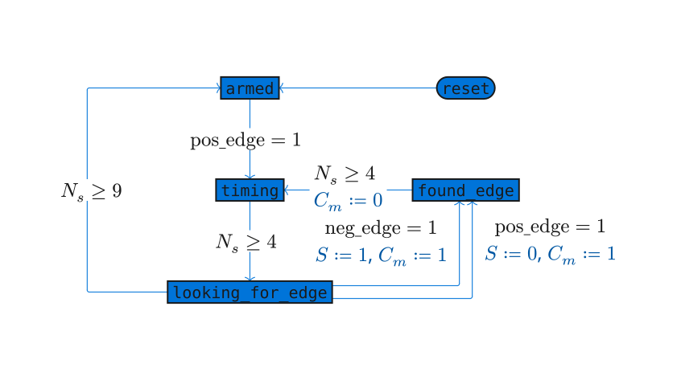
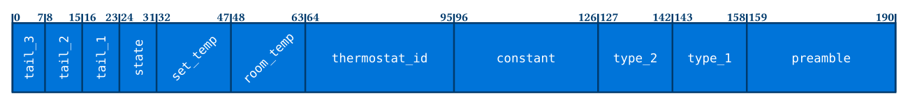
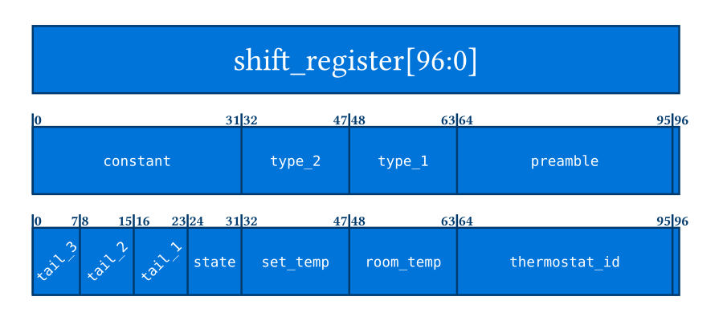

<!---

This file is used to generate your project datasheet. Please fill in the information below and delete any unused
sections.

You can also include images in this folder and reference them in the markdown. Each image must be less than
512 kb in size, and the combined size of all images must be less than 1 MB.
-->

## How it works

There are 2 state machines. One to decode the manchester encoded signal, and the
other to parse the data frames. For the manchester decoding aspect, the following
state machine is implemented.

Blue text are side effects of the transitions. $N_s$ is a counter that increments
while in each state, and is reset on each state transition.

The state machine makes use of a delay of 5 cycles in order to ignore any non-data
carrying transition.

The data sent over the air follows the following format.
(bit labels are as the data is shifted into a shift-register (0 = last bit received))

In order to save space in the design, since the preamble section and data section
are of equal length, only half of the message needs to be buffered at a time.

The below diagram shows 2 views into the shift register. The first view is used
to validate the existence of a preamble. Once that has been tripped, the system
reloads the register with 0x1, and fills the register again until the initial set
bit falls into the last (96) place, causing the shift register to halt all loads
until it is reset.

## How to test

Wire the system up, and read out the internal registers through the `parallel_out`
lines

| Address   | Parallel Out           |
| --------- | ---------------------- |
| 0000      | `thermostat_id[7:0]`   |
| 0001      | `thermostat_id[15:8]`  |
| 0010      | `thermostat_id[23:16]` |
| 0011      | `thermostat_id[31:24]` |
| 0100      | `room_temp[7:0]`       |
| 0101      | `room_temp[15:8]`      |
| 0110      | `set_temp[7:0]`        |
| 0111      | `set_temp[15:8]`       |
| 1000      | `state`                |
| 1001      | `tail_1`               |
| 1010      | `tail_2`               |
| 1011      | `tail_3`               |
| 1100-1111 | 00000000               |

## External hardware

Pin `ui_in[0]` (`digital_in`) must be connected to the digital output of a 433MHz receiver
