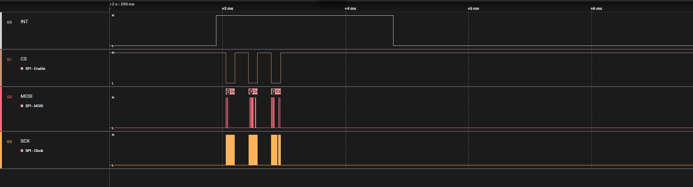
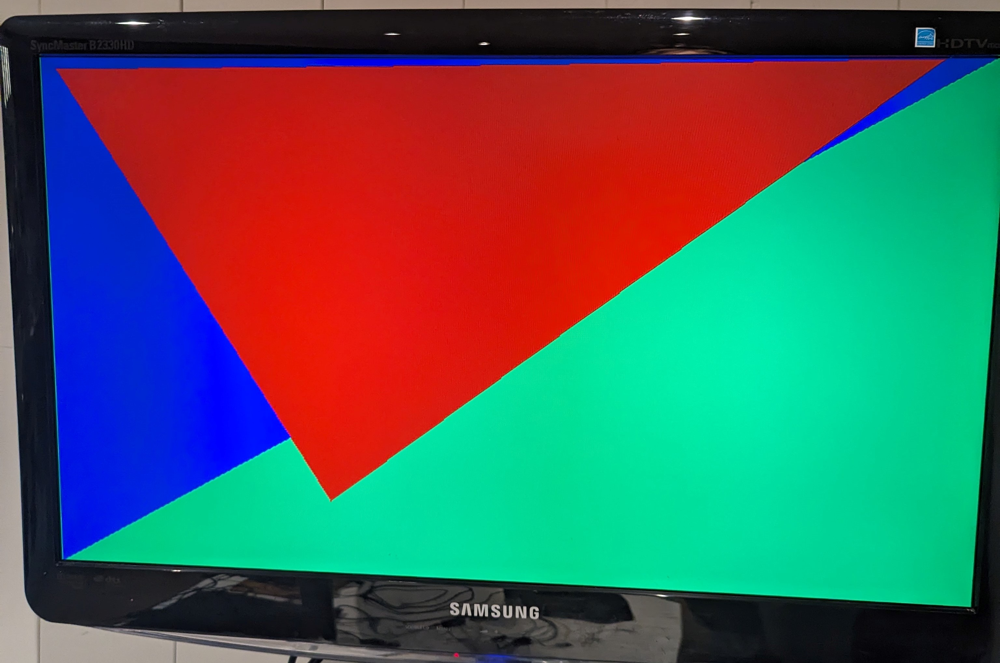

<!---

This file is used to generate your project datasheet. Please fill in the information below and delete any unused
sections.

You can also include images in this folder and reference them in the markdown. Each image must be less than
512 kb in size, and the combined size of all images must be less than 1 MB.
-->

## How it works

This project implements a GPU capable of rasterizing 4 triangles. It takes commands from any microcontroller via the SPI bus and draws them on screen at
640x480 @60Hz. All colors are 6 bits in depth (i.e rrggbb), giving up to 64 unique colors. It can also set a unique background color of your choosing.

Design expects a 25Mhz master clock frequency.

Triangles are supplied by their vertices. Note that not all vertex values are supported, only 80 X vertex positions and 60 Y vertex positions are allowed. This is acheived by taking the desired vertex position in the 640x480 native display resolution and dividing it by 8 on the host microcontroller side.

## How to test

The device can draw up to 4 polygons, A, B, C, D at a time. Since there is no Z-buffer, polygon A can be thought of as "closest" to the viewer, B "second closest", etc. If there is a region where your set polygons overlap, A will be rasterized over B and so on.

The "GPU" should be connected to the host microcontroller via SPI (tested with up to 4Mhz). Note that SPI communication here needs to be with LSB first formatting.
During each frame there is a certain amount of time which is not used to display any image. Here, the GPU will assert the INT pin, telling the host microcontroller that it is able to send new commands via SPI.

Example SPI transfers initiated after INT pin asserted

### Command set

Each SPI command contains a CMD byte along with 6 data bytes. The 6 data bytes are a packed bitfield with the following formatting:

[CMD - 8 bit] + [Color(r0r1g0g1b0b1) - 6 bit][Vertex 0 X - 7 bit][Vertex 1 X - 7 bit][Vertex 2 X - 7 bit][Vertex 0 Y - 6 bit][Vertex 1 Y - 6 bit][Vertex 3 Y - 6 bit][Unused - 3 bits]

Available Commands:\
SPI_CMD_WRITE_POLY_A = 0x80 \
SPI_CMD_CLEAR_POLY_A = 0x40 \
SPI_CMD_WRITE_POLY_B = 0x81 \
SPI_CMD_CLEAR_POLY_B = 0x41 \
SPI_CMD_WRITE_POLY_C = 0x82 \
SPI_CMD_CLEAR_POLY_C = 0x42 \
SPI_CMD_WRITE_POLY_D = 0x83 \
SPI_CMD_CLEAR_POLY_D = 0x43 \
SPI_CMD_SET_BG_COLOR = 0x01 

Note the SPI_CMD_SET_BG_COLOR command only utilizes the 6-bit 'Color' field, all other fields are ignored.

Example command setting a blue triangle in the top left corner.

Example of rendering 2 triangles + background color.

## External hardware

In order to use the project you will need the following:
- TinyVGA PMOD https://github.com/mole99/tiny-vga
- VGA screen
- Host microcontroller with SPI enabled
