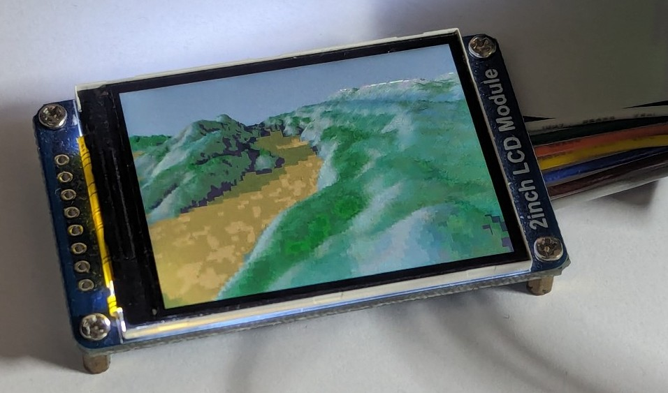

<!---

This file is used to generate your project datasheet. Please fill in the information below and delete any unused
sections.

You can also include images in this folder and reference them in the markdown. Each image must be less than
512 kb in size, and the combined size of all images must be less than 1 MB.
-->

## How it works

This design performs a 2D 'voxel' raycasting of a terrain, implementing in
actual hardware the 1992 [Voxel Space](https://en.wikipedia.org/wiki/Voxel_Space) algorithm used in the Comanche game.

The chip is designed in [Silice](https://github.com/sylefeb/Silice/),
the source code is in the [main repo](https://github.com/sylefeb/Silice/tree/wip/projects/qspi_terrain).

## How to test

A specific data file containing terrain data has to be uploaded to SPI-ram
before this can run. The plan is to do that from the RP2040 of the PCB.

Another way to test is on a IceStick HX1K. Instructions coming soon!

## External hardware

- [QSPI PSRAM PMOD from machdyne](https://machdyne.com/product/qqspi-psram32/)
- 240x320 ST7789V screen
