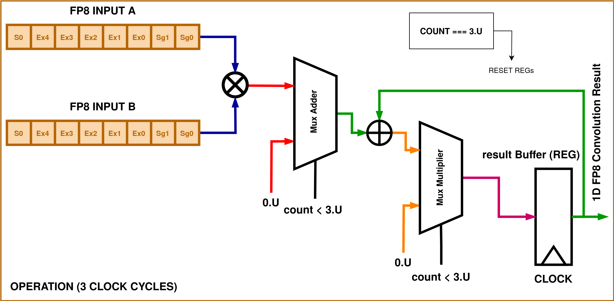
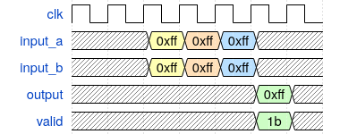

<!---

This file is used to generate your project datasheet. Please fill in the information below and delete any unused
sections.

You can also include images in this folder and reference them in the markdown. Each image must be less than
512 kb in size, and the combined size of all images must be less than 1 MB.
-->

## Design 

The digital block comprises of two sub blocks and a top module that incorporates a MAC (multiply-and-accumulate) operation.

This IEEE 754 format for a 8-bit FP precision for addition and multiplication is implemented. The operations incorporate intricacies and corner cases for handling +/- inf, NaN, Zeros and a full 8-bit precision range. 

| Details of FP8  | Binary Formats |
| :----------- | :------------: |
|Exponent Bias| $$15$$ |
|Infinites| $$S.11111.00_2$$|
|NaN|$$S.11111.XX_2$$|
|Zero|$$S.00000.00$$|
|Max Normal|$$S.11110.11_2$$|
|Min Normal|$$S.00001.00_2$$|
|Max Subnormal|$$S.00000.11_2$$|
|Min Subnormal|$$S.00000.01_2$$|

Though this format is highly limited in precision and range compared to standard floating-point formats like IEEE 754 single-precision (32-bit) or double-precision (64-bit). It would likely be used in specialized scenarios where memory is at a premium or where precision beyond this level is unnecessary. The MAC operations can be verified on the 8-bit FP data, with both addition and multiplication.

The following are the highlights and the pin descriptions:

- There are two inputs that take in FP8 data in the format S.EEEEE.SS
- The first stage of operation is a multiplication between the two inputs.
- The second stage is the addition on the multiplication result and the partial residing in the output register.
- At each clock cycle the partial result in latched to the output register, taking 3 cycles for giving the result.

## How to test

Run `make` in the `/test` directory.

## External hardware

The design is self sustaining sequential, requiring only an output buffer to store the current partial products and the MAC resultant after 3 clock cycles. This is supposed to be a preliminary result block that can make up systolic arrays, hardware accelerators and many other.
