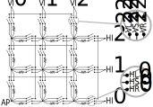

## How it works

A few resistors and switches are wired up in a matrix pattern.
Switches are implemented as pass gates controlled by latches that keep the configuration.
The network can be used as a makeshift DAC by controlling the "bitstream".

Matrix cells can be selected using the `H_GATE_i` and `V_GATE_j` inputs:

* `H_GATE_0` = `uio_in[5]`
* `H_GATE_1` = `uio_in[2]`
* `H_GATE_2` = `ui_in[1]`
* `V_GATE_0` = `uio_in[6]`
* `V_GATE_1` = `uio_in[3]`
* `V_GATE_2` = `uio_in[0]`

When the inputs `H_GATE_i` and `V_GATE_j` are on, the latches in the 
cell _ij_ become transparent and configure the pass gates as follows:

* `HR_ij` ← `HD_RES` = `ui_in[4]`
* `HS_ij` ← `HD_SHORT` = `ui_in[3]`
* `HL_ij` ← `HD_LINE` = `ui_in[2]`
* `VR_ij` ← `VD_RES` = `ui_in[7]`
* `VS_ij` ← `VD_SHORT` = `ui_in[6]`
* `VL_ij` ← `VD_LINE` = `ui_in[5]`

Once `H_GATE_i` or `V_GATE_j` is off again, the latches close and the
pass gates keep their configuration. Thus a new cell with different
_i_ or _j_ can be configured using the same inputs.
 
## How to test

After the network is configured as above, manipulate the digital inputs
`H_INPUT_i` and `V_INPUT_j` to apply 0 V or 1.8 V at the respective nodes
of the network:

* `HI_0` ← `H_INPUT_0` = `ui_in[0]`
* `HI_1` ← `H_INPUT_1` = `rst_n`
* `HI_2` ← `H_INPUT_2` = `clk`
* `VI_0` ← `V_INPUT_0` = `uio_in[7]`
* `VI_1` ← `V_INPUT_1` = `uio_in[4]`
* `VI_2` ← `V_INPUT_2` = `uio_in[1]`

The voltage can be measured externally at the analog pin `AP` = `ua[0]`.

## External hardware

Multimeter (or microcontroller with ADC) to measure the output voltage.
