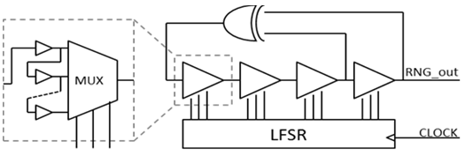

<!---

This file is used to generate your project datasheet. Please fill in the information below and delete any unused
sections.

You can also include images in this folder and reference them in the markdown. Each image must be less than
512 kb in size, and the combined size of all images must be less than 1 MB.
-->

## How it works

This project implements a LFSR where the D-type FFs (DFFs) are replaceded by configurable delay lines.

The configurable delay lines are implement using multiplexers and buffers. The buffers generate a delay line path and the multiplexer select differents paths according to its selection control signals. The selection control signals are generated by a conventional LFSR.

It's expected that this circuit act as either as a convencional LFSR, or as an oscillator, or as a chaotic oscilator, according to the path generated by each delay line.

To verify its functionality, four statistical tests from the NIST statistical suite are also implemented:
1. The Frequency (Monobit) Test
2. Frequency Test within a Block
3. The Runs Test
4. Tests for the Longest-Run-of-Ones in a Block

They are choosen because they require at least 100 bits sequence to test.

The implementations are based on the following works:
- L. B. Carreira, P. Danielson, A. A. Rahimi, M. Luppe and S. Gupta, "Low-Latency Reconfigurable Entropy Digital True Random Number Generator With Bias Detection and Correction," in IEEE Transactions on Circuits and Systems I: Regular Papers, vol. 67, no. 5, pp. 1562-1575, May 2020, doi: 10.1109/TCSI.2019.2960694
- V. B. Suresh, D. Antonioli and W. P. Burleson, "On-chip lightweight implementation of reduced NIST randomness test suite," 2013 IEEE International Symposium on Hardware-Oriented Security and Trust (HOST), Austin, TX, USA, 2013, pp. 93-98, doi: 10.1109/HST.2013.6581572.
- F. Veljković, V. Rožić and I. Verbauwhede, "Low-cost implementations of on-the-fly tests for random number generators," 2012 Design, Automation & Test in Europe Conference & Exhibition (DATE), Dresden, Germany, 2012, pp. 959-964, doi: 10.1109/DATE.2012.6176635.

## How to use

Explain how to use your project

## External hardware

List external hardware used in your project (e.g. PMOD, LED display, etc), if any
