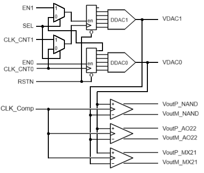

<!---

This file is used to generate your project datasheet. Please fill in the information below and delete any unused
sections.

You can also include images in this folder and reference them in the markdown. Each image must be less than
512 kb in size, and the combined size of all images must be less than 1 MB.
-->

## How it works

This project implements three different analog comparators based on standard logic cells. They are based on work of Sala et al. [1].

Two DACs, based on the work of Yang et al. [2], also implemented using only standard logic cells, with the aid of two 5-bit counters, generate an analog ramp signal to test the comparators.

1. R. D. Sala, C. Bocciarelli, F. Centurelli, V. Spinogatti and A. Trifiletti, "A Novel Ultra-Low Voltage Fully Synthesizable Comparator exploiting NAND Gates," 2023 18th Conference on Ph.D Research in Microelectronics and Electronics (PRIME), Valencia, Spain, 2023, pp. 21-24, doi: 10.1109/PRIME58259.2023.10161936
2. D. Yang, T. Ueno, W. Deng, Y. Terashima, K. Nakata, A. T. Narayanan, R. Wu, K. Okada, A. Matsuzawa, "A 0.0055mm2 480µW Fully Synthesizable PLL Using Stochastic TDC in 28nm FDSOI," IEICE Transactions on Electronics, v. E99.C, no. 6, 2016, pp. 632-640, doi: 10.1587/transele.E99.C.632

## How to test

The SEL pin alows to select two different test conditions. With SEL=0, both counters work together, generating a 10-bit sequence. For each step in the DAC1, DAC0 generates 32 different voltage levels, from near 0V to near Vcc. With SEL=1, both counters work independently.

## External hardware

It's necessary an osciloscope to visualize the outputs from the DACs and the comparators. 
