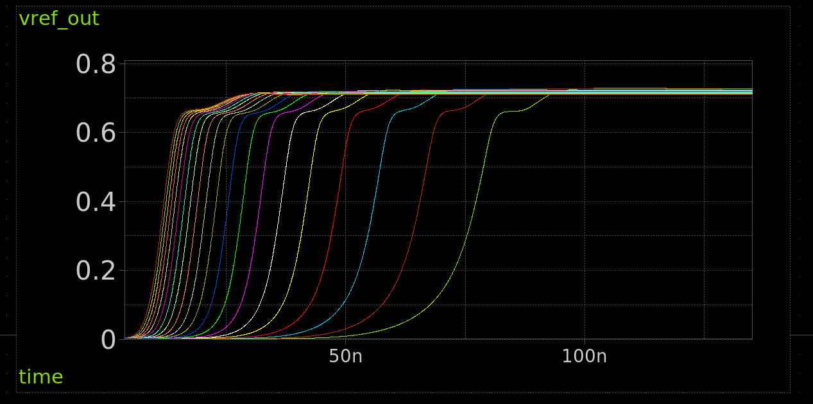

<!---

This file is used to generate your project datasheet. Please fill in the information below and delete any unused
sections.

You can also include images in this folder and reference them in the markdown. Each image must be less than
512 kb in size, and the combined size of all images must be less than 1 MB.
-->

## How it works

[Read the paper here](http://www.av.it.pt/conftele2009/Papers/16.pdf)

## Circuit

  

## Simulation

Simulated output is 0.71 to 0.725v across the 10 to 120 degrees C.

## How to test

Connect a multimeter to analog output 0. It should measure around 0.7v and remain constant with temperature.

## External hardware

Multimeter
