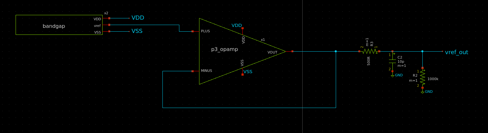
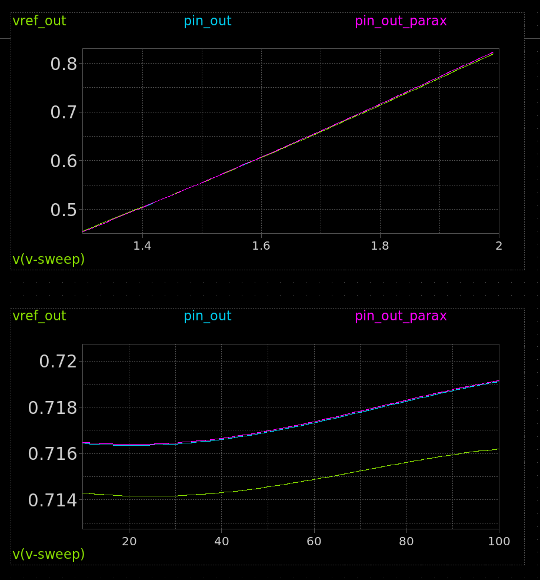
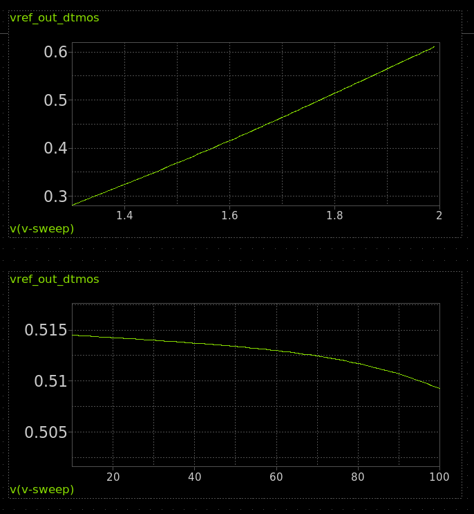

<!---

This file is used to generate your project datasheet. Please fill in the information below and delete any unused
sections.

You can also include images in this folder and reference them in the markdown. Each image must be less than
512 kb in size, and the combined size of all images must be less than 1 MB.
-->

## How it works

[Read the paper here](http://www.av.it.pt/conftele2009/Papers/16.pdf) and see the DTMOS variant below.

## Circuit

DTMOS variant connects the lower PMOS body to VSS instead of VDD.

  

## Simulation

## MOS

* Simulated output is 0.714 to 0.716v across 10 to 120 degrees C.
* Simulated output is 0.6 to 0.8v across 1.6 to 2v VDD.

## DTMOS

* Simulated output is 0.714 to 0.716v across 10 to 120 degrees C.
* Simulated output is 0.6 to 0.8v across 1.6 to 2v VDD.

## How to test

### MOS

Connect a multimeter to analog output 0. It should measure around 0.7v and remain constant with temperature.

### DTMOS

Connect a multimeter to analog output 0. It should measure around 0.7v and remain constant with temperature.

## External hardware

Multimeter, hot air gun to heat the chip

## References

* [A sky130 reference bandgap with results](https://github.com/johnkustin/bandgapReferenceCircuit)
* [DTMOS varient](https://www.researchgate.net/publication/4157633_Low-power_bandgap_references_featuring_DTMOSTs)
