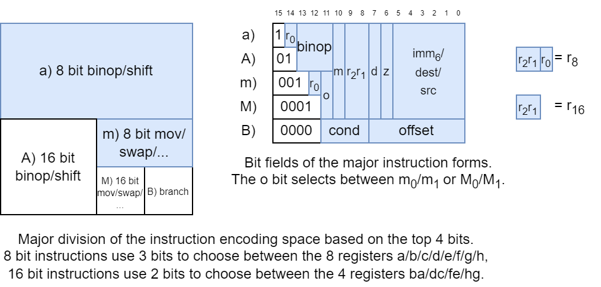
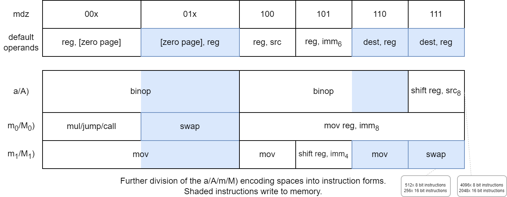
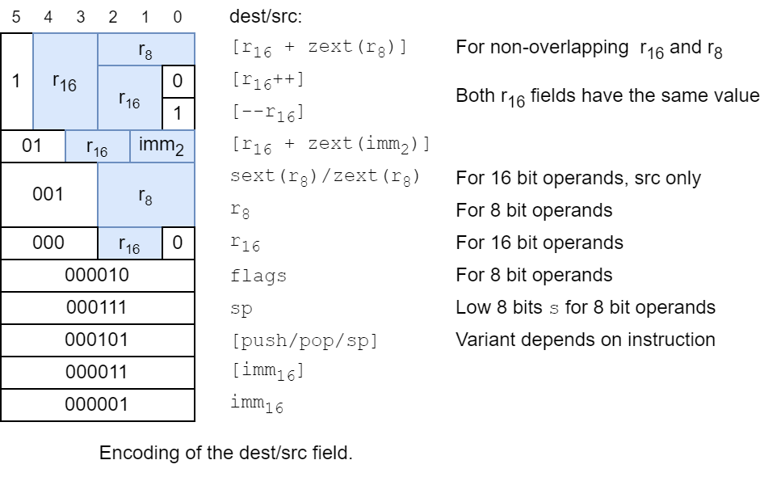
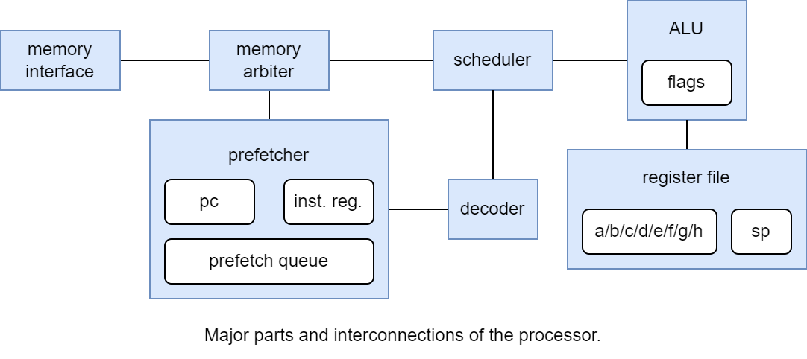

<!---

This file is used to generate your project datasheet. Please fill in the information below and delete any unused
sections.

You can also include images in this folder and reference them in the markdown. Each image must be less than
512 kb in size, and the combined size of all images must be less than 1 MB.
-->

## Overview

Basilisc-2816 v0.1 is a small 2-bit serial 2/8/16 bit processor that fits into one Tiny Tapeout tile.
It has been designed around the constraints of

- small area,
- 4 pin serial memory interface to a RAM emulator implemented in an RP2040 microcontroller (which can be supported by the RP2040 microcontroller on the Tiny Tapeout 7 Demo Board),
- to be suitable to be included in in the next version of the AnemoneGrafx-8 retro console https://github.com/toivoh/tt06-retro-console, which motivates the other constraints.

Features:

- 2-bit serial execution:
	- ALU results etc are calculated at 2 bits/cycle
	- 2-bit-serial register file with two read/write ports
	- Addresses and data are sent to/from memory at 2 bits/cycle
		- The processor starts to operate on each bit of incoming read data as it arrives
	- Saves area compared to processing 8/16 bits per cycle / using a parallel access register file
	- No point in calculating faster than the memory interface allows
- 8x 8-bit general purpose registers that can be paired into 4x 16-bit general purpose registers, plus an 8 bit stack register
- 8 bit and 16 bit versions of almost all instructions
- 64 kB address space
- 16 bits/instruction
- Quite regular and orthogonal instruction encoding, most instructions can use most addressing modes
	- `op reg, src` and `op src, reg` instruction forms
- Instructions:
	- `mov`, `swap`
	- `binop`: `add/adc/sub/sbc/and/or/xor/cmp/test`
		- for register-to-register also: `neg/negc/revsub/revsbc/and_not/`
		  `or_not/xor_not/not`,
	- `shl/shr/sar/rol/ror` with variable or immediate shift count,
	- `mul`: 8x8 and 8x16 bit multiply instructions, producing 2 result bits per cycle like everything else,
	- `branch cc, offset`: relative branch
		- unconditional/call/12 conditions including signed/unsigned comparisons,
	- `jump/call`: absolut direct/indirect jump/call,
	- additional functionality through combination with addressing modes, e g, `ret = jump [pop]`
- Addressing modes:
	- `[imm7]` / `[imm7*2]`: zero page
	- `[r16 + imm2]`
	- `[r16 + r8]`
	- `[r16]` with postincrement/predecrement
	- `[push]` / `[pop]` / `[top-of-stack]` depending on whether the operand is written/read/modified
	- `[imm16]`
- Sign/zero extension of any 8 bit register as source operand to 16 bit instructions
- `imm16` / `[imm16]` operands supported using extra instruction word
- 2-4 word instruction prefetch queue

Contents:

- Basilisc-2816 v0.1 variants in Tiny Tapeout 7
- Interface / pins
- Programmer's view
- Execution timing
- How it works

## Basilisc-2816 v0.1 variants

Basilisc-2816 v0.1 has been taped out in three variants for Tiny Tapeout 7:

	        mul           Prefetch     Hardened     Uses      Mux
	        instruction   queue size   with         latches   address
	v0.1a           yes            2   OpenLane 1        no       967
	v0.1b            no            3   OpenLane 2        no       202
	v0.1c           yes            4   OpenLane 2       yes        72

successively more experimental. Longer prefetch queue should help contribute to better performance,
especially with long memory access latencies.

The target clock frequency is 40 MHz for v0.1a, and 50 MHz for the others, but the max frequency may be higher or lower in practice.
It is unknown how the use of latches will affect max clock frequency (and correctness).
Reducing the memory access latency may be more important to performance than using a high clock frequency.

The three variants are availble at

- v0.1a: https://github.com/toivoh/tt07-basilisc-2816-cpu
- v0.1b: https://github.com/toivoh/tt07-basilisc-2816-cpu-OL2
- v0.1c: https://github.com/toivoh/tt07-basilisc-2816-cpu-experimental

This is the v0.1a version.

## Interface / pins

The TX/RX interface is used to send commands to the RAM/RAM emulator, and to receive read data.
Start bits are used to let each side initiate a message when appropriate, with subsequent bits sent on subsequent clock cycles.
The `tx_out` and `rx_in` pins must remain low when no messages are sent, to avoid being interpreted as start bits.

The TX channel / `tx_out[1:0]` pins are used for messages from the CPU:

- a message is initiated with one cycle of `tx_out[1:0] = 1` (low bit set, high bit clear/don't care),
- during the next cycle, `tx_out[1:0]` contains the 2 bit _TX header_, specifying the message type,
- during the following 8 cycles, a 16 bit payload is sent through `tx_out[1:0]`, from lowest the bits to the highest.

The RX channel / `rx_in[1:0]` pins are used for messages to the console:

- a message is initiated with one cycle when `rx_in[1:0] != 0`, specifying the _RX header_, i e, the message type,
- the value of `rx_in` during the next cycle is ignored,
- during the following 8 cycles, a 16 bit payload is sent through `rx_in[1:0]`, from lowest bits to highest.

All TX messages use the same start bit and the same length, to make them easier to receive for the RAM emulator.
The RX message has been prolonged to the same length as the TX messages so that the CPU can respond to an incoming RX message with an outgoing TX message without any delay.

TX message types:

- 0: 16 bit read request: Read 16 bit data. Payload is the byte address (can be uneven).
- 2: 8 bit write request: Write bottom 8 bits of payload to last read address.
- 3: 16 bit write request: Write payload to last read address.

There is only one RX message type: 1: 16 bit read response. Payload is 16 bit data.
Each read request must get exactly one read response, in the same order as the requests. Write requests must not get any response.

The two remaining output pins give additional information about the current TX message:

- `tx_fetch` is high when the current TX message is a read request for an instruction word,
- `tx_jump` is high when `tx_fetch` is high and the current fetch is for a jump destination.

The RAM emulator does not need to use these pin values to operate correctly, but they give additional information about what the CPU is doing. They are used by the gate level test.

The 2-bit serial RAM interface is motivated by the AnemoneSynth synth in https://github.com/toivoh/tt06-retro-console, which needs to be able to read and write 2 bits/cycle to and from memory for fast enough context switching between voices.
The 2-bit serial interface in turn shapes the design of the rest of the processor.

## Programmer's view

### Registers

The CPU has the following registers:

- 8 general purpose 8 bit registers `a - h`,
	- also available as four general purpose 16 bit register pairs `ba / dc / fe / hg`.
- 16 bit program counter `pc`, keeping the adress of the current instruction.
- Stack pointer register pair `sp`:
	- bottom half `p` is an 8 bit register,
	- top half `s` always reads as 1, making all stack operations work on the address range `0x100 - 0x1ff` (actually, `0xfe - 0x1ff`, see below).
- Flags register `flags`:
	- zero flag `z`, (bit 0)
	- sign flag `s`, (bit 1)
	- signed carry flag `v`, (bit 2)
	- carry flag `c` (bit 3).

At reset, the `pc` register starts at `0xfffc`, which is just enough to fit a `jump imm16` instruction before the `pc` wraps around.
All other registers are uninitialized at reset.

### Instructions

Most instructions operate on one general purpose register and one additional operand, which can be, e g, a register, memory, or an immediate value.
The `branch / jump / call / ret` instructions are always 16 bit; all others have corresponding 8/16 bit forms.
Generally, 8 bit instructions operate on 8 bit registers while 16 bit instructions operate on register pairs.

In the instruction descriptions below,

- `reg` is a general purpose register (pair) operand to an 8 (16) bit instruction.
- `dest/src` can be a general purpose register (/pair), a memory location, an immediate value (for `src`), among other things (see addressing modes below).
- `imm4/imm6/imm8` is a 4/6/8 bit immediate value, usually sign extended.
- `[zp]` is a _zero page memory location_ (see addressing modes below).

The following types of instructions are supported:

#### `mov dest, src`

Copy value from `src` to `dest`. Supported forms:

	mov reg, src
	mov dest, reg
	mov reg, imm8  // imm8 is sign extend if reg is 16 bit
	mov reg, [zp]
	mov [zp], reg

#### `swap dest, reg`

Swap the value of `dest` and `reg`. Supported forms:

	swap dest, reg
	swap [zp], reg

#### `binop dest, src`

Perform a binary operation on `dest` and `src`, write the result to `dest`, and update `flags` to reflect the result.

For the binary operations

	add dest, src  // dest = dest + src
	sub dest, src  // dest = dest - src
	adc dest, src  // dest = dest + src + c
	sbc dest, src  // dest = dest - src + c - 1
	and dest, src  // dest = dest & src
	or  dest, src  // dest = dest | src
	xor dest, src  // dest = dest ^ src

the following forms are supported:

	binop reg, src
	binop dest, reg
	binop reg, imm6  // imm6 is sign extend
	binop reg, [zp]
	binop [zp], reg

There are additional binary operations

	revsub dest, src  // dest = src - dest
	revsbc dest, src  // dest = src - dest + c - 1
	cmp    dest, src  // Update flags according to dest - src,
	                     don't update dest
	test   dest, src  // Update flags according to dest & src
	                     don't update dest

which support fewer forms:

	revsub reg, imm6  // replaces sub dest, imm6
	revsub reg1, reg2

	revsbc reg, imm6  // replaces sbc dest, imm6
	revsbc reg1, reg2

	cmp reg, src
	cmp reg, imm6
	cmp reg, [zp]

	test reg, src
	test reg, [zp]

To get a non-reverse `sub reg, imm6`, use `add reg, -imm6` instead.

The `binop reg1, reg2` form is also supported for the additional operations

	neg     dest, src  // dest = -src
	negc    dest, src  // dest = -src + c - 1
	and_not dest, src  // dest = dest & ~src
	or_not  dest, src  // dest = dest | ~src
	xor_not dest, src  // dest = dest ^ ~src
	not     dest, src, // dest = ~src

The binary operations `add/adc/sub/sbc/revsub/revsbc/cmp/neg/negc` update the `c, v` flags.
The `v` flag is set calculated so that signed and unsigned comparisons using `cmp` work the same, except that signed comparisons rely on the `v` flag instead of the `c` flag.
All binary operations update the `s, z` flags.

#### `shift reg, src8`

Perform a shift operation on `reg` using shift count from `src`.
The shift operation can be

	shl reg, src8  // reg = reg << src
	shr reg, src8  // reg = reg >> src, unsigned shift
	sar reg, src8  // reg = reg >> src, signed shift
	rol reg, src8  // rotate reg left
	ror reg, src8  // rotate reg right

Supported forms:

	shift reg, src8
	shift reg, imm4

The `src8` argument is always taken to be 8 bit even for 16 bit shifts.
16 bit shifts always use the bottom 4 bits of the shift count.
`shr` and `sar` use the bottom 4 bits also for 8 bit shifts, while the others use the bottom 3 bits. (Timing wise, right shifts use the bottom 4 bits and left shifts use the bottom 3 bits for 8 bit shifts).

#### `mul reg, src`

Unsigned multiply of 8/16 bit `reg` and 8 bit `src`, producing a 16/24 bit result.
Store the bottom part of the result in `reg`, and store the top 8 bits in `h`, unless `reg` is `h` or `hg`. (Instruction takes 4 cycles less to execute if top 8 bits are not stored).
Supported forms:

	mul reg, src8
	mul reg, imm6  // imm6 is unsigned

`reg` can not be `a`, `b`, or `ba`.

#### `branch cc, imm8`

Relative conditional branch: if the specified condition is true, jump `imm8` instruction words ahead of the current instruction. `imm8` is signed.
`branch cc, 0` jumps to itself. The encoding for `branch always, 0` is 0, so if the processor encounters a zero instruction word, it enters an infinite loop.
(This might be explicitly designated as an illegal instruction in future versions.)

Supported conditions:

	always
	call          // like always, but push address
	                 of next instruction before branching

	z / e         // zero / equal
	nz / ne       // not zero / not equal
	s             // signed
	ns            // not signed

	// unsigned comparisons:
	c / ae / nb   // carry / above equal / not below
	nc / nae / b  // not carry / not above equal / below
	a / nbe       // above / not below
	na / be       // not above / below

	// signed comparisons:
	v / ge / nl   // signed carry / greater equal / not less
	nv / nge / l  // not signed carry / not greater equal / less
	g / nle       // greater / not less
	ng / le       // not greater / less

#### `jump src16`, `call src16`, `ret`

`jump src16` performs an absolute unconditional jump to `pc = src16`.

Supported forms:

	jump src16
	jump [zp]

	call src16

`call` is like `jump`, but pushes address of the next instruction before jumping.
It can be used for calling a subroutine.

`ret` is a pseudoinstruction for `jump [pop]`, which pops a `pc` value from the stack and jumps to it.
It can be used for returning from a subroutine.

### Additional pseudoinstructions

Some more useful pseudoinstructions that can be realized using the existing instructions:

	push reg  // mov [push], reg
	pop reg   // mov reg, [pop]

	rlc1 reg  // adc reg, reg     // rotate left one step through carry flag

There are probably more.

### Addressing modes

For instructions that use a `dest` operand, `dest` can be one of

	reg               // 8/16 bit general purpose register,
	                     depending on size of the operand.
	sp/p              // Stack pointer.
	                     Read LSB p for 8 bit operands.
	                     Write only LSB p for any operand.
	flags             // Only for 8 bit operands. Not for shift/mul.
	[r16 + zext(r8)]  // r16 and r8 can not overlap.
	[r16++]           // Postincrement: increase r16 after calculating
	                     the address. Increase by 2 for 16 bit operands.
	[--r16]           // Predecrement: decrease r16 before calculating
	                     the address. Decrease by 2 for 16 bit operands.
	[r16 + zext(imm2)]// imm2 is multiplied by 2 for 16 bit operands.
	[imm16]           // imm16 value follows in next instruction word.
	[push] / [--sp]   // Push the result onto the stack.
	                     Only for operations that don't depend on
	                     the value of dest.
	                     Decreases sp by 2 for 16 bit operands.
	[sp]              // Top of stack. Only for operations that depend
	                     on the value of dest.

For instructions that use a `src` operand, `src` can be anything that `dest` can be except `[pop], [sp]`, and can also be

	sext(r8)        // Sign extend r8, only for 16 bit operations.
	zext(r8)        // Zero extend r8, only for 16 bit operations,
	                   not for cmp or test.
	imm16           // imm16 value follows in next instruction word.
	[pop] / [sp++]  // Pop the source from the stack.
	                   Increases sp by 2 for 16 bit operands.

The `[push]` and `[pop]` operands do not play well with each other when `sp` wraps around.
It is recommended to initialize `sp` to `0x1ff` or `0x1fe` when the stack is empty (by writing `0xff` or `0xfe` to the `p` register).
The `[push]` operand will write a byte to `[sp - 1]` or two bytes to `[sp - 2], [sp - 1]`, which can reach as low as `0xfe`. 8-bit wraparound will only affect the updated value of `sp` after the `[push]` operation.

Some instructions can use a `[zp]` operand, indicating a 7 bit memory adress `[imm7]`, which allows reaching the first 128 bytes in the address space.
For 16 bit operands, `[2*imm7]` is used instead, which can reach the first 256 bytes in the address space, as aligned 16 bit words.

### Instruction encoding

Each instruction is encoded into one of five major forms `a / A / b / B / M)`:
<!--
	bit position
	111111
	5432109876543210
	1eaaamrrdziiiiii    a: 8 bit binop/shift
	01aaamrrdziiiiii    A: 16 bit binop/shift
	001gomrrdziiiiii    m: 8 bit others (including shift)
	0001omrrdziiiiii    M: 16 bit others (including shift)
	0000ccccbbbbbbbb    B: branch
-->

where

- `a/A)` forms are mostly used for 8/16 bit binops,
- `m/M)` forms are used for 8/16 bit moves and other things, and
- `B)` form is used for branches.

The `mdz` bits are used togther with the major form to choose instruction form:

where

- The form of the instruction's operands is decided by the `mdz` value, except for the cases `mov reg, imm8`, `shift reg, src8`, and `mul/jump/call`.
- The `o` bit chooses between the `m0/M0` (`o = 0`) and `m1/M1` (`o = 1`) columns.
- `A)` and `M)` form instructions are 16 bit while `a)` and `m)` form instructions are 8 bit, except for `jump/call` which are all 16 bit.

Most instructions encode one general purpose register in `r2r1/r2r1r0`, and a source/destination in `imm6`.
The interpretation of the `imm6/dest/src` bits depend on the form of the instruction, including whether it is a source or a destination.
Zero page instructions use the `z` bit to extend the `imm6` field to a 7 bit immediate address,
and `mov reg. imm8` instructions use the `dz` bits to extend it to an 8 bit immediate.

The registers `a - h` are represented with the numbers 0 - 7; `ba - hg` with the numbers 0 - 3 (stored in a 2 bit field such as `r2r1`).
For `A/M)` form instructions, `reg` encoded in `r2r1`.
For `a/m)` form instructions, `reg` encoded in `r2r1r0`, but the `r0` bit is stored in different places in `a)` and `m)` form instructions.

The `binop` field in the `a/A)` forms selects which binary operation to use:

	binop   operation   alternate
	    0   add         neg
	    1   sub         revsub
	    2   adc         negc
	    3   sbc         revsbc
	    4   and         and_not
	    5   or          or_not
	    6   xor         xor_not
	    7   cmp/test    

The alternate form is used in for `binop` instructions with `mdz = 110` and two register operands (use `mdz = 100` for the regular form).
In the same way, `not` is the alternate form of `mov`, and is used under the same circumstances.
`sub reg, imm6` is replaced by `revsub reg, imm6` (use `add reg, -imm6` for `sub reg, imm6`).
`cmp` is replaced by `test` when `d=1`, but the form is kept as `cmp reg, src`.

The `binop` field is also used to specify the shift operation in `shift reg, src8`:

	binop   shift operation

	    0   ror
	    2   sar
	    4   shr
	    6   shl
	    7   rol

For `shift reg, imm4`, the top two bits of `binop` are stored in the top two bits of `imm6` (the bottom bit is implicitly zero), while the bottom 4 bits store the shift count.
`rol reg, imm4` should be encoded as

	ror reg, 16 - imm4       // for 16 bit reg
	ror reg, (8 - imm4) & 7  // for  8 bit reg

Multiplication instructions are encoded in the `mul/jump/call` case with `r2r1 != 0` (which excludes the use of `a/b/ba` for the `reg` operand).
When `r2r1 = 0`, absolute jumps and calls are encoded instead:

	111111
	5432109876543210
	0010000000iiiiii	jump src16
	0010000001iiiiii	call src16
	000100000ziiiiii	jump [zp]

For branches, `offset` is the `imm8` offset, which is sign extended and multiplied by 2 and added to the address of the branch instruction to get the target `pc` value.
The `cond` field selects the branch condition according to

	cond   branch condition

	   0   always
	   1   call          // like always, but push address
	                        of next instruction before branching

	   4   z / e         // zero / equal
	   5   nz / ne       // not zero / not equal
	   6   s             // signed
	   7   ns            // not signed

	   8   c / ae / nb   // carry / above equal / not below
	   9   nc / nae / b  // not carry / not above equal / below
	  10   a / nbe       // above / not below
	  11   na / be       // not above / below

	  12   v / ge / nl   // signed carry / greater equal / not less
	  13   nv / nge / l  // not signed carry / not greater equal / less
	  14   g / nle       // greater / not less
	  15   ng / le       // not greater / less

When `dest/src` is used in an instruction, it is encoded into the `imm6/dest/src` field according to

<!---
	543210
	1RRrrr   [r16 + r8]          RR != rrr[2:1]
	1RRrr0   [r16++]             rr = RR
	1RRrr1   [--r16]             rr = RR
	01RRii   [r16 + imm2]
	001rrr   r8                  for 8 bit operands
	001rrr   sext(r8)/zext(r8)   for 16 bit operands
	000010   flags               for 8 bit operands
	000RR0   r16                 for 16 bit operands
	000001   imm16
	000011   [imm16]
	000101   [push/pop/sp]       interpretation depends on instruction
	000111   sp

where

- `RR` encodes `r16`,
- `rrr` encodes `r8`, and
- `ii` encodes `imm2`.
-->

The `d` bit chooses between `sext(r8)` (`d=0`) and `zext(r8)` (`d=1`), except that the `test` instruction uses `sext(r8)` even though it is encoded with `d=1`.
For the `imm16` and `[imm16]` cases, the `imm16` value follows the instruction word. For 8 bit instructions, `imm16` still takes 16 bits, but only the lower 8 bits are used by the instruction.

## Execution timing

The that it takes to execute differemt instructions is influenced by 4 main factors:

- the number of execution cycles needed for a given instruction,
- cycles needed to wait for access to the TX channel, for instructions that send read/write requests to memory,
- cycles needed to wait for read response data, for instructions that read memory, and
- availability of new instructions to execute from the prefetch queue (which is flushed by jumps).

See the Inferface / Pins section for details of the memory interface.
In the processor, the memory interface is shared between

- the _prefetcher_, which tries to fetch new instruction words a few steps ahead of the current program position, and
- the _scheduler_, which executes instructions, including making any memory accesses that they need to perform.

If the TX channel is idle and both try to start a new message TX message at the same time, the scheduler has priority.

### Instruction stages

The scheduler divides the execution of a given instruction into a subset of the following stages:

	                               ror1 stage -> rotate stage
	address stage -> data stage ->
	                               mul1 stage -> mul2 stage

executed in the above order (the top and bottom tracks are mutually exclusive), where

- the _address stage_ is used by instructions that need to send a memory address to RAM,
- the _data stage_ is the main stage, and is used by most instructions to calculate and store their result,
- the _ror1_ and _rotate stages_ are used by `shift` instructions, and
- the _mul1_ and _mul2_ stages are used by `mul` instructions.

Stages that are not needed for the current instruction are skipped, and when the last stage that is needed is done, the instruction finishes.
No extra cycles are needed to skip the address stage or to finish an instruction, but otherwise it takes one cycle to skip an unused stage.

The address stage always sends a read request on the TX channel, and takes 10 cycles starting from when the scheduler gains access to the channel.

The data stage takes a different number of cycles depending on the instruction:

- 4/8 cycles are needed to calculate and/or store an 8/16 bit result.
- If the instruction reads memory, the data stage needs to wait for the read response data to start arriving.
	- It does not need to wait for the read message to finish before finishing (when reading 16 bits but only needing 8).
- If the instruction writes memory, the data stage needs 6/10 cycles to send a write message on the TX channel (this includes two cycles to send a message header and 4/8 cycles to calculate and send the payload data, for 8/16 bit data).
- For read-modify-write instructions, the write request message will be initiated in the same cycle as the start bit for the read response is received for the read sent during the address stage.
- If the data stage reads and/or writes the `pc` register, (calls read from `pc`, all kinds of jumps write `pc`)
  it needs to wait for the prefetcher to be idle first.
	- The prefetcher is blocked while reading from the `pc`.
	- Writing to the `pc` is combined with sending the first read request to start prefetching from the jump destination, and is also combined with reading from `pc` for branches.
- Branches use only the data stage, and untaken branches finish after one cycle in the data stage.

Read-modify-write instructions send a read command on the TX channel, and reply with a write command when the read response is received, updating the data at the address just read. Since they need to be able to respond with a TX message as soon as an RX message arrives, and because the destination address for the write is given by the last read address, read-modify-write instructions block the prefetcher from sending read requests while waiting for their read response.

`mov` and `swap` are not considered to be read-modify-write instructions. They send a read request to specify the address, immediately followed by a write request to write the data. `swap` instructions need to wait for the read response before they can finish, but the prefetcher is allowed read access during the wait.

`shift` and `mul` instructions with immediate second operand skip the address and data stages completely.
Other `shift` and `mul` instructions use the data stage (and address stage if needed) to load the shift count / multiplication factor from the second operand, which is always treated as 8 bit, also timing wise.

The ror1 stage is used by most shifts. It rotates the destination register right by a single bit if needed, clears the needed bits for `shl`, and finds the value of the sign bit for `sar`.
It takes 4-5/8-9 cycles for 8/16 bit shifts (the extra cycle is a rotate right one step is needed).
The ror1 stage is skipped if either

- the shift count is zero (the shift instruction is finished immediately from the ror1 stage), or
- the shift count is even, except for `sar` and `shl` instructions.

The rotate stage is used by all shifts except when the shift count is zero. It rotates the destination register right by 2 bits/cycle, taking as many cycles as needed to produce the desired rotation. It also feeds in zero/sign bits for `shr` and `sar` instructions.

The mul1 stage is used by all `mul` instructions. It calculates the bottom part of the product (the part that is stored into the first operand), and takes 4/8 cycles for 8/16 bit operands.
The mul2 stage is used to write the top 8 bits of the product to the `h` register. It takes 4 cycles, but the instruction is finished after the mul1 stage if the `h` register overlaps with the destination.

### The prefetcher

The objective of the prefetcher is to try to keep the decoder and scheduler fed with instruction words, even though it might take some time between the point when a read request is sent and the read response data is received.
The prefetcher has a prefetch queue of 2 - 4 instruction words (see Basilisc-2816 v0.1 variants above).

When the current instruction is finished (or there is no currently executing instruction), the decoder tries to load the next instruction from the head of the prefetch queue to start executing it.
Instructions that use an `imm16` operand (including `[imm16]`) wait for and load an additional instruction word from the prefetch queue before they can start. This takes at least one cycle.

An instruction word is considered to be in the prefetch queue from the point when it the read request is sent to when it is loaded into the instruction and/or immediate register, or is flushed due to a jump.
As long as the prefetch queue is not full, the prefetcher tries to send new read requests to fill it.

When a read response for a prefetch arrives, the instruction word is stored in the 2 - 4 prefetch queue buffers (same number as the size of the prefetch queue) waiting to be consumed by the decoder and/or scheduler.
The whole instruction word must arrive into the first buffer before it is considered valid.
Even if the other prefetch queue buffers are empty, it takes on cycle for an instruction word to traverse each one.

### Jumps

Whenever a jump is taken, the current contents of the prefetch queue are flushed, meaning that they will not be used (including responses to read requests that have already been sent, but where the response has not yet arrived).

Jumps update the `pc` register during the data stage. At the same time, they send the first read request to prefetch from the jump destination.

Calls (whether relative or absolute) are special in that they are scheduled like two instructions in sequence: `push pc+2 / push pc+4` followed by the corresponding `jump` instruction.

### Performance considerations

Performance characteristics of different types of instructions:

- Instructions that operate on only registers and immediates are generally fast, don't need to wait for memory access, and allow the prefetcher to work in parallel.
	- 8/16 bit `mov/swap/binop` with only register (including `sp/p/flags/`
	`sext(r8)/zext(r8)`) and immediate operands generally take 4/8 cycles.
	- `shift` and `mul` instructions usually take more cycles (see above), but still allow the prefetcher to work in parallel, except for in the address stage (if any).
		- `shift` and `mul` instructions with immediate second operand are faster since they don't need to spend time on loading the shift count/factor.
		- For `shift` instructions, the ror1 stage can be skipped under certain circumstances, and the length of the rotate stage depends on the shift count: small right shifts / big left shifts are faster (see above).
- `mov/binop reg, mem` instructions need to send a read request and wait for the response, but allow the prefetcher to work while waiting for the response. Likely, the prefetcher has a chance to get ahead while waiting.
- `mov mem, reg` instructions need to send a read request and a write request, but don't need to wait for a response.
- `swap mem, reg` instructions need to send a read request and a write request, and wait for the read response, but allow the prefetcher to run while waiting.
- Read-modify-write instructions `binop mem, reg` need to send a read request and a write request, and block the prefetcher while waiting for the read response.
- (Taken) jumps flush the prefetch queue, causing execution to stall until new instructions can arrive at the decoder.
- `imm16` / `[imm16]` operands require an extra instruction word to be prefetched (and require one additional cycle to load).
  They still allow the data to be prefetched, unlike with reads initiated by the instruction.

The things to be most careful about performance wise are probably read-modify-write instructions and jumps. On the other hand, read-modify-write instructions can help relieve register pressure, and jumps are often necessary and sometimes save more time than they cost.

## How it works
<!---
	memory    <-> memory  <-> scheduler <-> ALU <-> register
	interface     arbiter         ^                 file
	                 ^            |
	                 |            |
	                 V            V
	            prefetcher <-> decoder
-->

The CPU consists of a number of parts:

- The _memory interface_ communicates with the external memory (RAM emulator) to send and receive serial messages.
- The _memory arbiter_
	- arbitrates memory command transmission between the prefetcher and scheduler, and
	- keeps track of outstanding responses, directing incoming responses to the intended recepient.
- The _prefetcher_
	- keeps track of and updates the _program counter_ (PC) register,
	- tries to fetch instruction words a few steps ahead of the currently executing instruction,
	- buffers prefetched instruction words in the prefetch queue buffer, and
	- keeps track of the currently executing instruction in the _instruction register_ and the _immediate register_.
- The _decoder_
	- recieves the current instruction from the prefetcher/instruction register, and
	- decodes it into control signals for the scheduler.
- The _scheduler_
	- evaluates branch conditions,
	- divides instructions into stages,
	- runs the stages needed for each instruction in order, and
	- sets control and data signals to the ALU and other parts of the CPU as needed to execute each stage.
- The _ALU_ (arithmetic logic unit)
	- calculates ALU operations (binary operations `add/sub/adc/sbc/and/or/xor` etc), shifts, and multiplies,
	- breaks down operations on 16 bit register pairs into back-to-back operations on 8 bit registers,
	- breaks down and schedules calculations into 2-bit serial steps,
	- updates the flags based on the results of a computation,
	- reads external inputs and produces an external result when needed, and
	- reads and updates the register file.
- The _register file_
	- holds most of the CPUs registers: general purpose registers `a-h` and `sp`, and
	- mediates access to the flags as the `flags` register.

### 2-Bit serial operation

The CPU uses 2-bit-serial operation wherever it can. This means that instead of operating on all bits of a value in parallel, it operates on 2 bits per cycle.
Since the memory interface can only send/reveive 2 bits/cycle, there is little point in making most other things operate faster. Serial operation saves area compared to parallel operation for both computions and registers.

Consider adding two values that are stored in separate registers. Addition starts from the least significant 2 bits (lsbs), and proceeds upwards, 2 bits/cycle. To facilitate this, the registers are organized as shift registers, which can be right-shifted two bits per cycle, feeding out the 2 bottom bits. At the same time, two new bits are fed into the top.

The two lsbs from each register respresent a value between 0 and 3, and the sum has a value between 0 and 6. With a carry bit coming in, the sum can be between 0 and 7.
The bottom 2 bits of the sum are used as the result at the current 2-bit position, while the top bit is used as the carry into the next 2-bit position. A flip-flop is needed to store the carry from one cycle to the next. At each step (cycle), the registers are shifted right by two bits, so that the 2 bits to be operated on are always at the bottom of each register.

The addition can be performed in place, replacing the value in one of the registers with the result: The result bits are just shifted into the top of the register. If a register should keep its value after the operation, the lsb bits shifted out are shifted back into the top at the same time.
When the register contents have been shifted around to the starting position, the addition is completed.

### Memory arbiter

The memory arbiter keeps track of which block is currently using the TX channel, if any.
If both the prefetcher and scheduler try to start a transaction at the same time, the scheduler gets priority. The scheduler has been designed under the assumption that it will get priority whenever it raises the `reserve_tx` signal, which also blocks the prefetcher from sending any new TX messages.
This is needed for read-modify-write instructions, which send a read request followed by a write request, where the read address is reused as write address for the write request.

The memory arbiter has a FIFO that keeps track of outstading requests (reads), which have been started but where the response has not yet finished.
The FIFO keeps track of whether a given read response should be handled by the prefetcher or the scheduler, or if it should be ignored completely.
The ignore feature is used for write instructions (`mov mem, reg`, `push pc+2/4` during `call`s), where the read message is just used to set the write address. This allows the scheduler to move on without waiting for a read response.
The scheduler is designed to have only one outstanding (non-ignored) read, so that when it receives a read response, there is no doubt about what the data is for.

### Prefetcher

The prefetcher holds the 16 bit program counter register `pc`, and updates it using 2-bit serial operations, which can add a delta to the `pc` or set a new value.
The least significant bit of `pc` is always expected to be zero, but the storage space is still needed since 2-bit serial addition causes the `pc` value to rotate around through the `pc` bits.

Except when jumping, the `pc` register is incremented by 2 for each prefetch.
When the prefetcher sends a read message on the TX channel, it scans through the `pc` register and increments it at the same time, sending the incremented `pc` value as the read address. The bits of the incremented `pc` value are sent as soon as they are calculated, starting from the lsbs.

The prefetcher also keeps track of the number of prefetched and flushed instruction words.
The `pc` register does not store the address of the currently executing instruction, instead it stores the address of the last instruction that was prefetched, `curr_inst_addr + 2*num_prefetched`.

An instruction word is considered prefetched between when a read request is first sent for it and when it leaves the prefetch queue to enter the instruction and/or immediate register, or is considered flushed by updating the `num_flushed` register.
The prefetcher has space to store 2-4 prefetched instruction words that have been read but not yet executed.
It takes a cautious approach, and will not send prefetch read transactions unless there is currently space to store the read response data in the prefetch queue buffers when it arrives.
The first buffer stage is a serial shift register to receive incoming serial data.
Each remaining buffer stage is loaded in parallel from the previous stage. This occurs when one stage has valid data and the next one does not, making the instruction words fall through the prefetch queue buffers until there is no free space to fall into.

The prefetcher also holds the instruction and immediate registers. When loading a new value into the instruction register, the same value is loaded into the immediate register as well. For instructions that use an `imm16` or `[imm16]` argument, the immediate register is loaded with the next value from the prefetch queue.

The instruction register is used as the input to the decoder. The immediate register is used to feed the ALU with an immediate value, typically shifting out 2 bits per cycle. This works since the immediate field is always placed in the least significant bits of an instruction.
The bottom half of the immediate register is also used to store the shift count of `shift` instructions and 2nd operand of `mul` instructions. `shift/mul` instructions that don't have these stored as immediates shift the needed data into the immediate register during the data stage.
The top half of the immediate register is also used as scratch space by the `mul` instruction.

When reading out the `pc` (for branches and calls), the adder that is normally used to increment it is used to subtract `2*num_prefetched` to compute the address of the current instruction. The prefetcher must be blocked from sending new read requests to allow reading out the `pc` register. In the case of branches, the `pc` is read out, adjusted, updated, and used to send a prefetch read request for the jump destination, all at the same time:
The adjusted `pc` value is sent to the ALU, which adds the offset from the branch, and sends the branch target `pc` value to be sent as prefetch address and stored in the `pc` register. Jumps are similar to branches, but don't need to read the current value of the `pc`, just to set it to the value output from the ALU.

The reason that the prefetcher outputs the incremented `pc` value as read address is so that the same target address can be stored into the `pc` register and output in a prefetch read request when jumping, saving an adder.

When jumping, the prefetcher also sets `num_prefetched = 1`, to reflect that the jump is started with a single prefetch.
Before that, `num_flushed` is set to `num_prefetched`, to flush all instruction words prefetched after the the jump instruction that was executed.
As long as `num_flushed` is nonzero, instruction words that arrive at the output of the prefetch queue are discarded immediately, instead of feeding the instruction or immediate registers, or waiting to be consumed. The `num_flushed` register is decreased by one for each time an instruction word is discarded in this way.

### Prefetch queue using latches instead of flip flops

The experimental v0.1c version of the CPU uses latches instead of flip flops in the prefetch queue buffers and instruction register.
This saves space, but is a bit more tricky to work with. Hopefully, it works as intended.

To try to make the latches behave as desired, the design

- avoids glitches on the gate input of each latch by feeding it directly from a flip flop, and
- makes sure that the input data to each latch stays stable one cycle after the gate was closed.

Each buffer stage includes 16 latches, a valid flag register, and a write enable register.
The cycle-by-cycle transfer of data from one stage to the next proceeds as follows:

1. When one buffer stage has valid data and the next stage does not, the write enable signal of the second stage is raised.
2. The second stage's write enable register goes high, opening the latch gates in the second stage to read the data from the first stage.
	- At the same time, the second stage's valid register goes high, indicating that the output data is valid, since the latch is transparent.
	  This causes the write enable signal to go low.
3. The valid flag of the first stage goes low, due to the write enable that was high during the previous cycle.
4. The first stage may change its data during this cycle, since the valid flag was low during the previous cycle.

Compared to using flip flops for the prefetch queue buffers, the concern is mostly about keeping the input data to each latch stage stable for one cycle after the gate goes low. Instruction words can still propagate through the queue at one stage per cycle, if there is space.

The instructon register works much like the final stage of the prefetch queue buffer, and can be treated in the same way.
The last stage in the prefetch queue buffer can also feed the immediate register or be flushed, but this mostly adds some logic for when to clear its valid flag.

### Decoder

The decoder decodes instruction words according to instruction type, instruction form, and addressing mode, and instructs the scheduler which operations need to be performed: which operation, sources, and destination to use for the data stage, which operation and sources to use for the address stage (if any source or destination in the data stage needs one), whether to update flags, if special features like swapping, condition codes, shifting, and multiplication should be activated, etc.

The decoder also schedules a `push pc+2` or `push pc+4` as the first stage of executing a call (including `branch call`) instruction, which is otherwise executed just like a `jump/branch`, calculating the size of the instruction already at the push stage.
Philosophically, this falls into the domain of the scheduler, but practically, it was simpler to let the decoder take care of this scheduling task to avoid complicating the stage structure of the scheduler.

### Register file

The register file is indexed using 4 bit register indices.
The first 8 indices are connected to the general register file, while additional indices are used for the `s, p`, and `flags` registers.
The general register file is implemented using a bank of addressable shift registers; the additional registers are implemented with some extra glue logic and storage.

The general register file has two read/write ports, with separate 3 bit register indices, enable signals, inputs and outputs.
It is implemented as 8 addressable 8 bit shift registers. Registers that are addressed through a read/write port that is enabled are shifted, shifting in the input value for the appropriate port. The input from port 1 has priority.

If a value should be read out without being modified, the user of the register file (the ALU) needs to recirculate the bits that are read out from the port back to its input.
Each port is generally expected to be enabled 4 times in sequence with the same register index, so that values can circulate back to their original bit positions. The exception is shift operations, which vary the number of enable cycles to achieve different bit shifts.

### Addressing modes

When sending a read/write address using a read request on the TX channel, the address bits need to be retrieved/computed 2 bits at a time.
The ALU and register file have nothing else to do at this time, and are used to calculate the address.
Either the ALU's second argument is used as the result (just like in a `mov` instruction, which ignores the destination's value), or an addition is used, sometimes exploiting the ALU's feature to multiply the second argument by two (used only for address computations, branches, and calls).
The ALU can also sign/zero extend the second argument to different lengths, which is used by various addressing modes.

Postincrement/predecrement addressing modes (including `[pop]` and `[push]`) write the result of the computation back to the ALU's first register argument, just like instructions that write to registers. For the postincrement case, the ALU result is written to the register, while the value read out from it is used as the address.

There are more options that make sense for `src` operands than `dest` operands.
This fact is used to differentiate between the `sext(r8)` and `zext(r8)` source forms; `zext(r8)` is `sext(r8)` with the `d` bit set to 1, which would normally mark it as a destination. (Except for the `test` instruction, which also uses the `d` bit to distinguish it from the `cmp` instruction, but retains `sext(r8)` behavior.)

### `swap` instructions

`swap reg1, reg2` instructions work like `mov reg1, reg2` instructions, but feed the second register file port's input with the output from the first.

`swap mem, reg` instructions use a special trick to be able to start reading out the register data immediately and start shifting in the new data later, when it arrrives.
First, for 16 bit swap instructions, the two register ports are connected as one big shift register,
to avoid having to switch between lower and upper halves of a register pair; reading and writing would not agree on when to switch.

The write request is started as soon as possible after sending the read request, and the ALU is allowed to shift out bits from the register file to feed as write payload, but the ALU does not start counting cycles to finish the operation. The bits shifted into the target register at this point may be garbage.
When the read response payload arrives, the ALU starts counting cycles. The payload bits are shifted into the target register and the instruction is finished. This may partially overlap with the cycles used to read out the original register contents.

This setup allows the register file to take care of read response data without sending a write message in response (it has already been sent), which means that the scheduler doesn't have to block the prefetcher while waiting for the read response data.

### `shift` instructions

`shift` instructions rely on the register file's ability to shift/rotate values in place, rotating right 2 bits per cycle.
For this reason, all shift operations operate in place on register values.
Some complications arise since

- the only supported shift step is 2 bits (how to handle odd shift counts?),
- the only supported shift direction is right shift,
- the sign bit (top bit) of the registers in the register file is not readily available, but needed by `sar`.

For the 16 bit case, both register file ports are connected together to form a 16 bit shift register.

To work witin the restrictions:

- Odd shift amounts are handled by the ror1 stage, which needs 5/9 cycles to rotate an 8/16 bit value right one step by rotating it right 5/9 cycles in steps of 2 bits, through a 1 bit delay.
- `sar` records the sign bit at the end of the ror1 stage.
- Left shifts and rotates are implemented using right rotation with `8 - shift_count` or `16 - shift_count` number of steps.

Also:

- `shr` and `sar` instructions replace the topmost bits with zeros/the sign during the final rotate stage (and the final ror1 cycle, for odd shifts).
- `shl` replaces bits with zeros during the `ror1` stage - the bit positions to be cleared are exactly those that will not be rotated through the lsbs during the final rotate stage.
- The shift count for `rol` / `shl` is negated while loading it into the immediate register during the data stage.
	- `rol reg, imm4` must be encoded a a `ror` instruction, with a negated shift count.

### `mul` instructions

`mul` instructions use the immediate register for two purposes:

- The bottom half, which we will call the `factor` register in this context, holds the 8 bit unsigned factor from the second operand.
- The top half, which we will call the `partial` register in this context, holds a partial sum.

For `mul reg, imm6` instructions, the `imm6` factor is loaded into the `factor` register when loading the instruction.
For `mul reg, src` instructions, the data stage loads the `factor` register, in the same way as `shift reg, src` instructions load the same register with the shift count.

A `mul` instruction multiplies an 8/16 bit destination register with the 8 bit `factor` register, producing a 16/24 bit product.
Every cycle, it consumes 2 bits from the original value of the destination register and produces two bits of the product.

Consider multiplying an 8 bit factor `dcba` with an 8 bit value `hgfe`, where each letter denotes 2 bits.
The needed computation can be written as

	 dcba    * h
	  dcba   * g
	   dcba  * f
	+   dcba * e
	--------

The basic algorithm starts by calculating `dcba * e`, the first term in the sum, forming the current partial sum. This is the only term that affects the bottom 2 bits of the result, which can be output as the first 2 result bits. The remaining bits are shifted 2 steps right to align with the next level.
In the second step, `dcba * f` is added to the partial sum from the last step, producing a new partial sum, and everything proceeds as before, etc.

The basic algorithm still requires the multiplication of an 8 bit factor by a 2 bit number every cycle.
Multiplication by 0 and 1 are easy, and multiplication by 2 is just a left shift, but multiplication by 3 would require an extra adder.
Instead, the multiplier multiplies by -1. This produces the same result for the lowest 2 bits. At the same time, it sets a carry to add one to the incoming 2 bit value during the next cycle. This results in the need to multiply by a number between 0 and 4, but 4 can be handled in a similar way 3, in this case: multiply by zero, set a carry for the next step.

In total, the multiplier requires

- 9 bits of scratch space for the partial sum (the `partial` register and a sign bit, reusing the ALUs temporary sign bit (not the sign flag)),
- an 11 bit adder,
- a one step shifter, and provisions to multiply the factor by zero or invert its bits.

## How to test

TODO

## External hardware

Requires the RP2040 microcontroller on the Tiny Tapeout 7 demo board or similar to serve as RAM emulator, adhering to the memory interface protocol described above.
