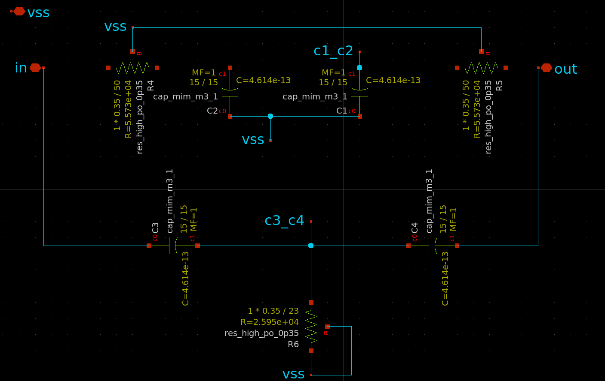
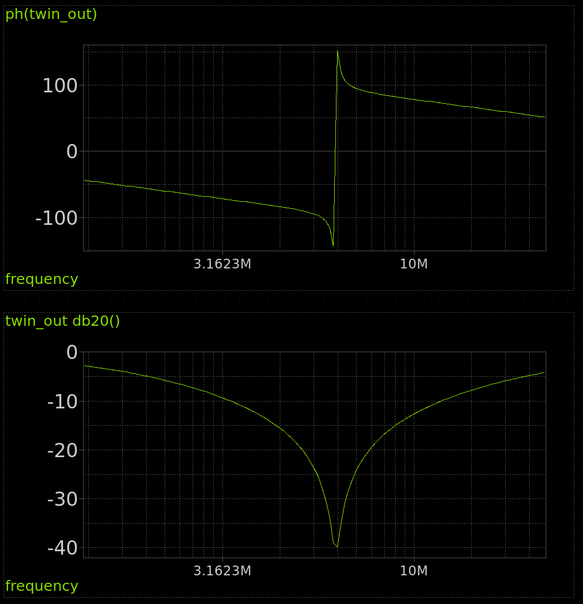
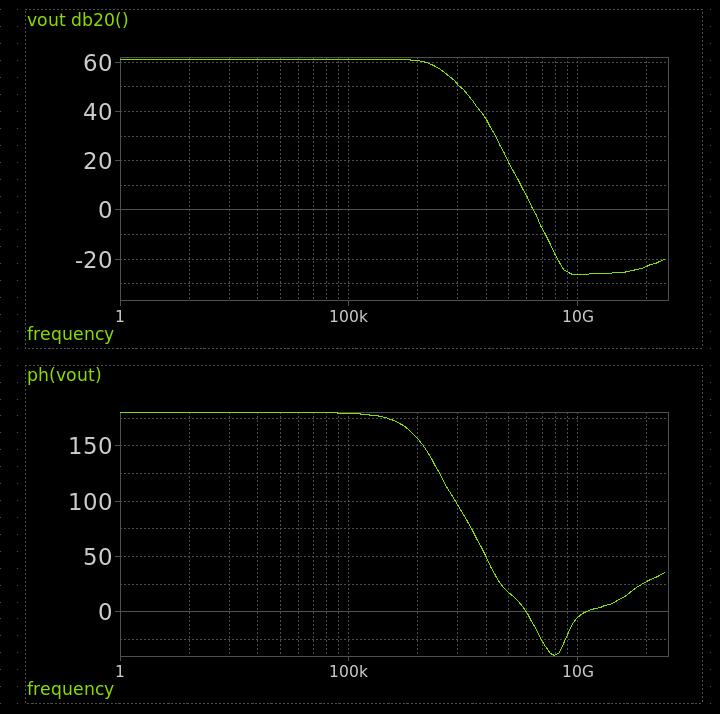
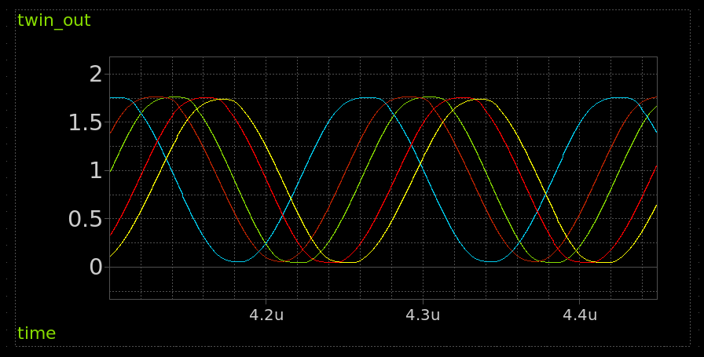
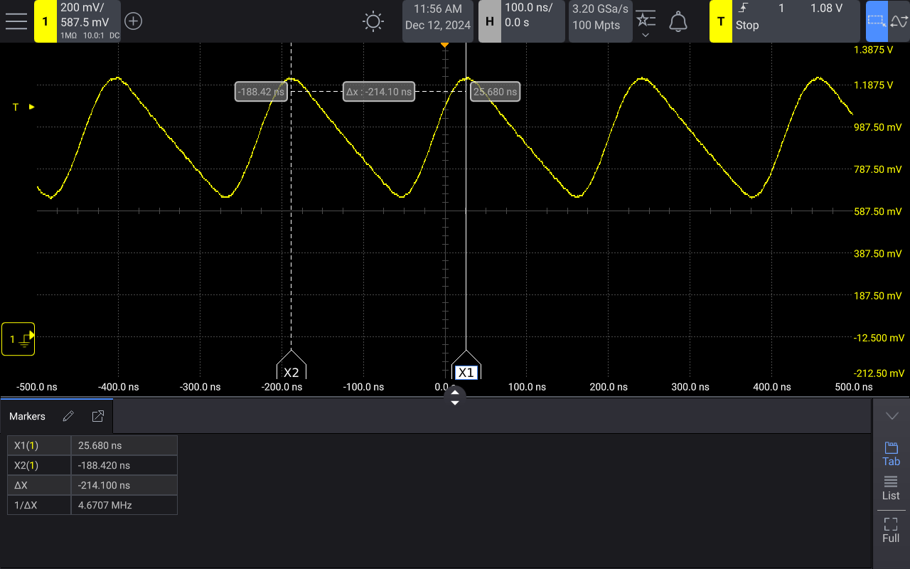

<!---

This file is used to generate your project datasheet. Please fill in the information below and delete any unused
sections.

You can also include images in this folder and reference them in the markdown. Each image must be less than
512 kb in size, and the combined size of all images must be less than 1 MB.
-->

## How it works

The circuit uses a "Twin Tee" filter along with an opamp to generate a sine wave.

https://www.electronics-tutorials.ws/oscillator/twin-t-oscillator.html

    f = 1 / 2 * pi * RC

### Notch filter AC analysis

### Opamp AC analysis

### Transient analysis

This simulation was done with a "montecarlo mismatch corner" which aims to test how well the circuit will work
as the resistance and transistors change across process corners. Each run is shown in a different colour. If R6 resistor
in the Twin Tee filter is too high, the oscillations quickly die out, so it's deliberately undersized at the expense of
distortion in the sine wave.

## Acknowledgements

* The [opamp design comes from Sai](https://github.com/argunda/tt06-tiny-opamp)
* The [opamp layout comes from Pat Deegan](https://github.com/psychogenic/tt06-analog-wowa)
* Inspired by this video by [Alan Wolke](https://www.youtube.com/watch?v=KFVVozlXoOk). 

## How to test

After the project is enabled, you should see a sine wave at around 6.3MHz on analog output pin 0.

There is also a 20 bit digital counter connected to the oscillator output. The top 8 bits are connected to the LEDs.
So you should also see the most significant bit flashing every ~6 seconds.

## External hardware

Oscilloscope.

## Silicon results

The measurement was made with a Keysight HD3 scope. The design is very sensitive to loading, so a scope probe was connected direct to the pad (after removing the pulldown).

The frequency was measured at 4.67MHz, which is 26% slower than anticipated. You can also see the wave is less sinusoidal than simulated. This is most likely related to how sensitive the design is to loading. For a future version, I will use an opamp with a stronger output stage. 
