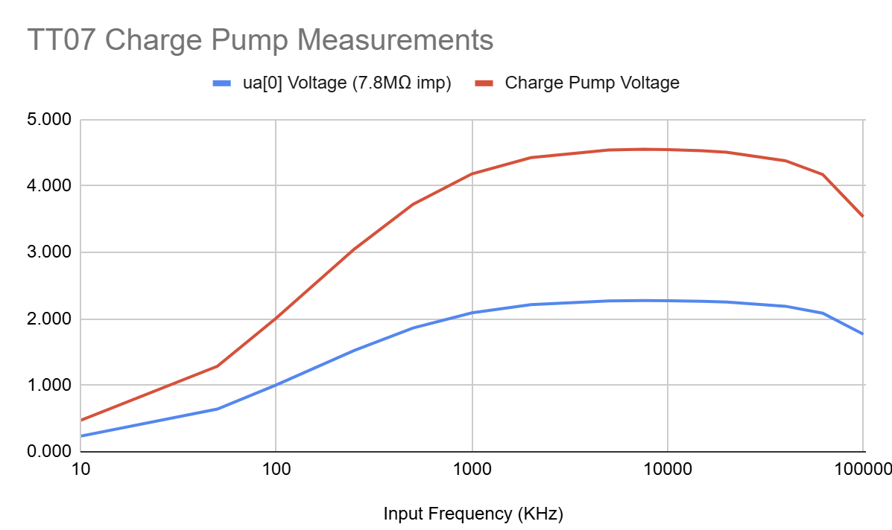

<!---

This file is used to generate your project datasheet. Please fill in the information below and delete any unused
sections.

You can also include images in this folder and reference them in the markdown. Each image must be less than
512 kb in size, and the combined size of all images must be less than 1 MB.
-->

## How it works

A 3-stage dickson charge pump. The output voltage is `Vout = 4*(VPWR - Vths) = ~5.44 V` where `VPWR` is the digital input voltage (1.8 V), and Vths is the threshold voltage of the LVS NMOS (nominal 0.44 V when width=7, length=8).

## How to test

Apply a clock signal of 2 MHz to the `clk` input. In TT07, the analog pin voltage is limited to VDDIO/VDDA (usually 3.3 V), so the output voltage will be divided by two. You can measure the divided output voltage at the `ua[0]` (vout_div) pin.

## Simulation results

Post layout simulation showing the output voltage `x1.vout` and the divided output voltage on ta `ua[0]` pin. The output voltage stabilizes at ~5.0 V, and the divided output voltage at ~2.5 V. The current draw is about 357 nA.

The following graph shows the input clock, the intermediate voltages at the output of each stage, the output voltage, and the divided voltage as they rise during the first 10 us of operation.

## Silicon measurements

The output voltage on `ua[0]` was measured with a digital multimeter that has a 7.8MΩ input impedance, at various clock frequencies. The following table summarizes the results:

| Input Frequency (KHz) | ua[0] Voltage | Charge Pump Voltage \* |
|-----------------------|---------------|------------------------|
| 0                     | 0.065         | 0.130                  |
| 10                    | 0.236         | 0.472                  |
| 50                    | 0.643         | 1.286                  |
| 100                   | 1.006         | 2.012                  |
| 250                   | 1.524         | 3.048                  |
| 500                   | 1.862         | 3.724                  |
| 1000                  | 2.091         | 4.182                  |
| 2000                  | 2.213         | 4.426                  |
| 5000                  | 2.271         | 4.542                  |
| 7500                  | 2.276         | 4.552                  |
| 10000                 | 2.274         | 4.548                  |
| 15000                 | 2.265         | 4.530                  |
| 20000                 | 2.254         | 4.508                  |
| 40000                 | 2.190         | 4.380                  |
| 62000                 | 2.086         | 4.172                  |
| 100000                | 1.768         | 3.536                  |

\* The charge pump voltage is the ua[0] voltage measurement multiplied by 2. This is because the analog pin voltage is limited to 3.3 V, so the charge pump voltage is divided by 2.

The following graph shows the output voltage as a function of the input frequency:

Overall, it seems that the charge pump works as expected, with the output voltage peaking at around 4.55 V when the input frequency is in the 5-10 MHz range.

## Project layout

